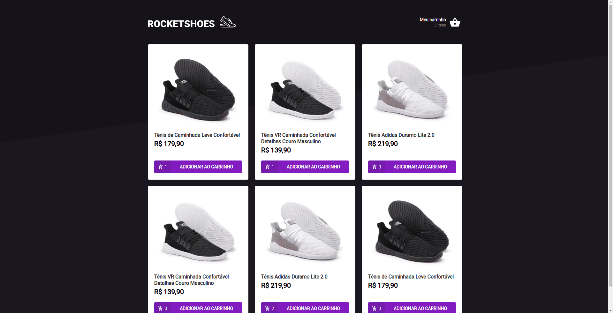
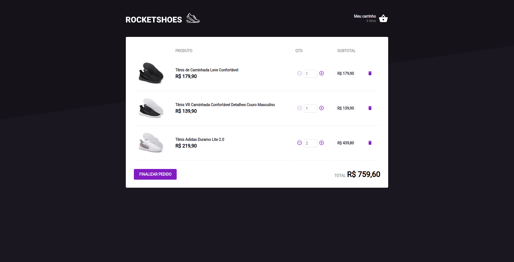

<h4 align="center"> 
	Projeto concluído! 
</h4>

<p align="left">Rocketshoes é um projeto que compõem o primeiro desafio do segundo módulo da trilha de ReactJS do Ignite, bootcamp da Rocketseat. </p>
<p align="left">Neste projeto fomso desafiados a implementar as funcionalidades de adicionar e remover os produtos do carrinho de um e-commerce verificando a disponibilidade dos mesmo no estoque. </p>
<p align="left">Tal tarefa foi realizada com o uso da Context API ou useContext do ReactJS. O useContext é um hook que permite a manipulação de dados de diferentes páginas ou componentes da aplicação de modo simples e descomplicado, além de permitir uma fácil manutenção do código devido a organização apresentada com o uso deste hook. </p>
<p align="left">Os produtos e o estoque presentes no projeto e foram obtidos através de uma fake api criada com o JSON Server. Os possíveis erros presentes durante o uso da aplicação são exibidos para o usuário através de toasts criados com a biblioteca React Toastify.</p>

### Tecnologias utilizadas
---

* ReactJS
* TypeScript
* useContext
* Styled Components
* Local Storage
* JSON Server
* React Toastify


### Features
---

- [x] Adicionar produto ao carrinho
- [x] Remover produto do carrinho
- [x] Indicação da quantidade de tipos de produtos no carrinho 

### Screenshots
---

* Mobile


* Web



### Como instalar
---

```bash
# Clone este repositório
$ git clone https://github.com/mayconrr13/todonext.git

# Instale as dependências
$ yarn 

# Execute a aplicação a fake api do JSON server
$ yarn server

# Execute a aplicação ReactJS
$ yarn dev

# Acesse a aplicação
$ http://localhost:3000
```

### Autor
---

Maycon dos Reis Rosário

### Entre em contato!

[](https://www.linkedin.com/in/mayconreisrosario/) 
[](mailto:mayconrr13@gmail.com)
